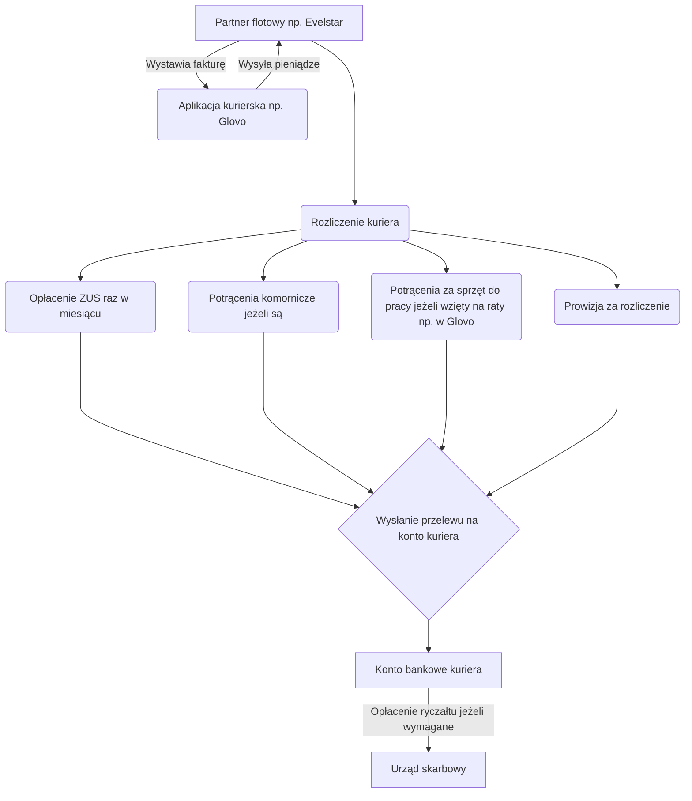

## Materiał video:



(Materiał z 15 października 2022 roku. Jeżeli będzie aktualizacja, zostanie wrzucony nowy link)

## Gdzie się zarejestrować?

Aby zarejestrować się, potrzebujesz konta u partnera flotowego, który pośredniczy między kurierem a aplikacją kurierską, następnie musisz zarejestrować się w danej aplikacji kurierskiej, przejść weryfikacje (poczekać dany okres czasu, jeżeli nie ma aktualnie rekrutacji), otrzymać lub kupić sprzęt (torbę termiczną).

## Po co mi partner flotowy?
Przeczytaj: [Jak wypłacane są pieniądze?](#jak-wypłacane-są-pieniądze)

## Wybór partnera flotowego

W Polsce do wyboru mamy paru partnerów flotowych. Działają na zasadzie pośrednictwa pomiędzy dostawcą a aplikacją kurierską.

**Partner flotowy sprawdzony, rekomandowany przez Dexterowskiego oraz wielu innych kurierów:**

>[Evelstar](https://evelstar.com) - Zatrudniamy na podstawie umowy zlecenie kierowców, dostawców oraz kurierów pracujących na aplikacjach. Dzięki temu osoba pracująca przy pomocy aplikacji nie musi zakładać działalności gospodarczej jednocześnie rozliczając w legalny sposób wszystkie należne podatki.



  

## Wybór aplikacji kurierskiej

Do wyboru ma się poszczególne aplikacje kurierskie: Glovo, Wolt, Uber Eats, Bolt Food, Stuart, Szama Express. W zależności w którym mieście chcesz jeździć musisz się zorientować czy dana aplikacja tam działa. Pytanie te najlepiej zadać swojemu partnerowi flotowemu drogą mailową.

Poniżej tabelka która nam przedstawi główne różnicę między wszystkimi aplikacjami: 


|                                   | Glovo                        | Wolt                             | Uber Eats                                | Bolt Food              | Stuart            |
|-----------------------------------|------------------------------|----------------------------------|------------------------------------------|------------------------|-------------------|
| Minimalny wiek do pracy           | 18 lat                       | 18 lat                           | 18 lat                                   | 18 lat                 | 16 lat            |
| Operacje gotówkowe                | Tak                          | Nie                              | Nie                                      | Nie                    | Tak               |
| Opłata za aplikację               | 4.92zł / okres rozliczeniowy | Nie                              | Nie                                      | Nie                    | Nie               |
| Okres rozliczenia                 | Co tydzień                   | Co tydzień                       | Co tydzień                               | Co tydzień             | Co tydzień        |
| Dodatkowy zarobek                 | ~~Wyzwania~~                 | "Godziny szczytu" np. 15% więcej | Questy                                   | Dodatkowe mnożniki     | Konkursy          |
| Ocena kuriera                     | Wynik doskonałości           | Brak                             | Ocena kuriera przez restauracje, klienta | Brak                   | Punkty karne (XD) |
| Tryb pracy                        | Grafik                       | Offslot (kiedy chcesz)           | Offslot (kiedy chcesz)                   | Offslot (kiedy chcesz) | Grafik            |
| Dopłata za dojazd do restauracji  | Tak                          | Tak                              | Częściowo                                | Tak                    | Tak               |
| Tryby pojazdu które można ustawić | Pieszo, Rower, Skuter, Auto  | Rower, Skuter, Auto              | Rower, Skuter, Auto                      | Rower, Skuter, Auto    | Rower, Auto       |


## Minimalny wiek do pracy

* **Glovo** - minimum 18 lat
* **Uber Eats** - minimum 18 lat
* **Wolt** - minimum 18 lat 
  


* **Stuart** - minimum 16 lat 



* **Bolt Food** - minimum 18 lat
* **Szama Express** - minimum 16 lat
  


## Jak wypłacane są pieniądze?

Aplikacje delivery np. Glovo czy Uber Eats rozliczają się na podstawie wystawianych faktur za wykonane usługi przewozowe. Oznacza to, że one nie zatrudniają bezpośrednio ludzi i jedyną podstawą do wypłacenia pieniędzy jest **Faktura VAT** oraz [kontraktu B2B](/content/docs/begin/2-procesy-aplikacji-do-delivery.md#kontrakt-b2b). Z tego powodu dla ułatwienia całego procesu potrzebny jest nam **partner flotowy**, który to właśnie zatrudni nas na podstawie danej umowy. Taka firma potem wystawia aplikacji kurierskiej FV w naszym imieniu na kwotę zarobionych przez nas pieniędzy.

Poniżej znajduje się przykładowa sekwencja rozliczania pieniędzy z aplikacji delivery

*Trzeba pamiętać, że czynników jest bardzo dużo - można sobie obliczyć przykładową wypłatę na [kalkulatorze rozliczeń](https://dexterowski.pl/misc/kurier.php)*

